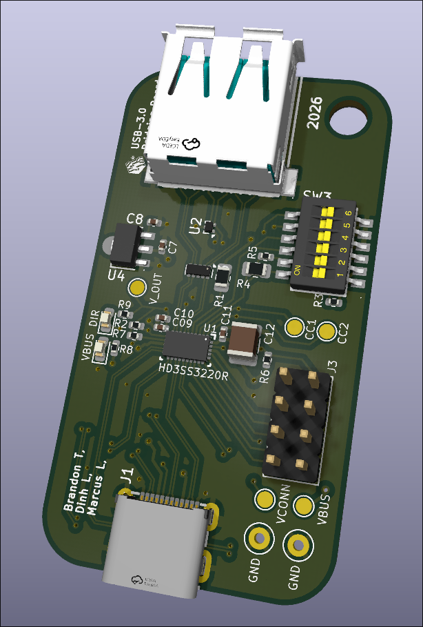
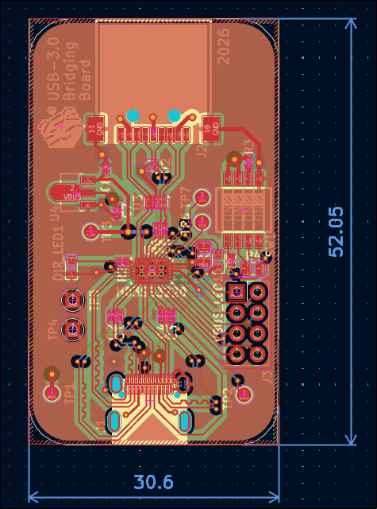
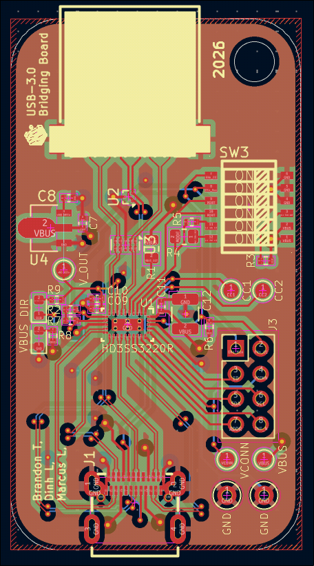
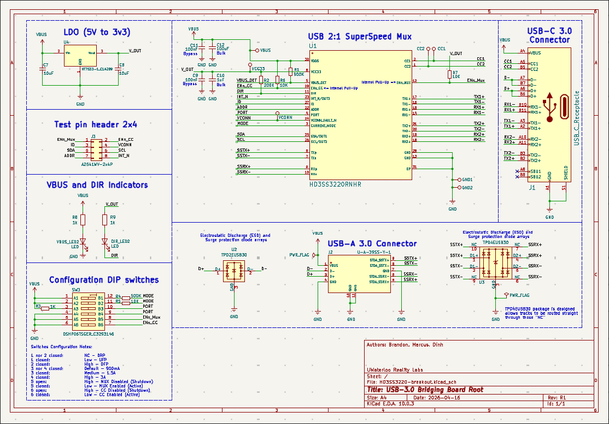

# HD3SS3220 USB-C Mux Test Board

This is a project designed to bridge the gap between our FPGA board and modern USB-C devices, offering a great look into how the devices we interact with daily actually work under the hood! 

This test board utilizes the **HD3SS3220RNHR USB-C Multiplexer** to validate USB 3.0 functionality from our FPGA board's USB interface chip, effectively bridging a USB 3.0 Type-A (female) connection to a USB-C (female) connection. 

## 📸 Project Previews

**3D Render & PCB Layout:**
\

**Schematics:**

---

## ⚙️ Architecture & Configuration Notes
* **Configurable DRP, UFP and DFP Implementation:** Configured for Dual-Role Port, Downstream Facing Port and Upstream Facing Port functionality (refer to Section 4 of the HD3SS3220 datasheet).
* **Always-On Operation:** The chip automatically wakes up and cannot be disabled via a computer, as `ENn_CC` is tied directly to ground.
* **Power Constraints:** VBUS_DET and VDD5 are kept separate (though they default to 5V, power negotiation causes voltage variations). Currently, the board requires an **external 5V power source**.

---

## 📏 High-Speed Routing Constraints (USB 3.0)

To ensure 5 Gbps signal integrity, the following rigid design rules were implemented during layout:

### 1. Differential Pair Routing & Symmetry
* **Intrapair Matching:** Length matching is strictly intrapair (TX+ to TX-, RX+ to RX-). TX and RX pairs do not need to match each other. Serpentine routing is applied as close to the mismatched ends as possible.
* **Symmetry:** High-speed pairs are purely symmetrical. Any IC breakout mismatch is resolved within 0.25 inches of the package.
* **Via Management:** Vias are minimized. Any unavoidable layer transitions ensure via stubs are kept under **15 mils** (back-drilled if necessary).

### 2. Clearances & Spacing
* **5W Rule:** Maintained a spacing of at least 5x the trace width between different high-speed signal pairs.
* **Keep-Outs:** Maintained >30 mils clearance from normal signals, and >50 mils from clocks/oscillators (not that we have one).
* **Plane Edges:** Traces are routed at least 90 mils away from the edge of the GND reference plane, and at least 1.5W away from any generic plane voids.

### 3. ESD Protection & Signal Path
* **ESD Placement:** TPD2EUSB30 / TPD4EUSB30 diodes are placed immediately at the USB connector.
* **Geometry:** Flow-through routing only (no stubs). Sharp bends are eliminated using large-radii rounded corners to prevent E-field buildup.
* **Test Points:** Strictly **NO** test points on high-speed pairs.

### 4. AC Coupling Capacitors
* **Footprints:** Symmetrically placed **0402** packages.

---
